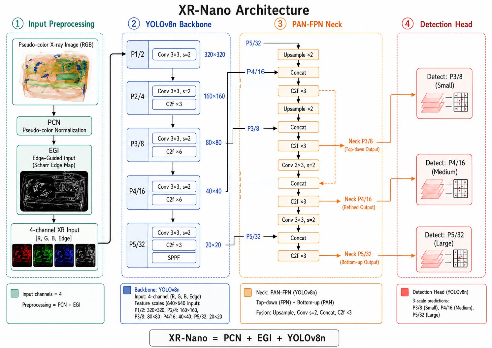

# XR-Detection

面向 X 光安检图像的小目标检测研究仓库。项目以 Ultralytics YOLOv8 为基础，围绕输入侧增强与轻量结构改造，逐步形成 XR 系列模型，包括 `XR-Nano`、`XR-Lite`、`XR-Plus` 等变体。

当前仓库重点不是做一个通用检测框架，而是支撑一条可复现实验链路：
- 在 `SPXray` 上完成模型设计、对比和阶段性筛选
- 在 `PIDray` 上做跨数据集验证与泛化检查
- 用脚本和测试固定关键统计、结果提取与结论口径

> 当前结论应理解为阶段性结论：`XR-Nano` 是当前候选主线，不是已经在所有公开数据集上最终定型的主模型。

## XR-Nano Overview



## 项目目标

- 研究伪彩色 X 光图像上的输入增强策略
- 评估边缘引导输入对违禁品检测的实际收益
- 比较轻量结构增强模块在精度、速度、参数量之间的取舍
- 建立从训练、评估到结果整理的可复现实验工作流

## 仓库结构

| 路径 | 说明 |
| --- | --- |
| `configs/` | 数据集 YAML 与实验配置入口 |
| `docs/` | 阶段文档、实验方案、主线结论、数据准备说明 |
| `papers/figures/` | 论文与 README 使用的结构图、示意图 |
| `scripts/` | 结果提取、数据统计、实验对比脚本 |
| `tests/` | 面向脚本和关键逻辑的回归测试 |
| `ultralytics/` | 基于 YOLOv8 的本地代码与模型改造实现 |
| `runs/` | 本地训练与评估输出目录，不纳入 Git |
| `datasets/` | 本地数据集目录，不纳入 Git |

## 模型族定位

| 模型 | 核心改动 | 主要用途 | 当前定位 |
| --- | --- | --- | --- |
| `YOLOv8n` | 原始基线 | 轻量 baseline | 基准对照 |
| `YOLOv8s` | 更大基线 | 对照更高容量模型 | 参考上界 |
| `XR-Nano` | `YOLOv8n + PCN + EGI` | 输入侧增强主线 | 当前候选主线 |
| `XR-Lite` | 在 XR-Nano 基础上加入轻量注意力/结构增强 | 验证结构增强收益 | 阶段性对比模型 |
| `XR-Plus` | 引入更强的小目标分支/结构扩展 | 检查更重结构的收益与代价 | 扩展对比模型 |
| `P2-Lite` | 强调更低层检测分支 | 小目标结构消融 | 专项消融模型 |

## 数据与权重说明

本仓库默认不上传以下内容：

- 原始数据集与派生数据视图，如 `datasets/`
- 训练与评估输出，如 `runs/`
- 本地权重文件，如 `*.pt`

你需要在本地准备数据和初始权重，再运行训练或评估命令。

当前仓库已有的配置入口包括：

- `configs/datasets/SPXray.yaml`
- `configs/datasets/SPXray_pcn.yaml`
- `configs/datasets/SPXray_pcn_egi.yaml`
- `configs/datasets/PIDray.yaml`
- `configs/datasets/PIDray_pcn_egi.yaml`

其中 PIDray 相关配置还拆分了 `easy / hard / hidden / test` 多个评估视图，便于单独验证不同难度子集。

## 环境与安装

建议使用 Python 3.10+，并在独立环境中运行。

```powershell
conda create -n xr-detection python=3.10 -y
conda activate xr-detection
pip install -r requirements.txt
```

如果你已经有自己的实验环境，也可以直接复用，只要保证 `ultralytics` 相关依赖与本仓库代码兼容。

## 快速开始

### 1. 准备数据

- 将 `SPXray` 与 `PIDray` 数据放到本地 `datasets/` 目录
- 按 `docs/PIDray_stage4_preparation.md` 的约定准备 PIDray 的 Ultralytics 兼容视图
- 确认数据 YAML 指向的是你本机的实际路径

### 2. 训练 XR-Nano

项目中的训练通常直接通过 `YOLO(...).train(...)` 调用完成。下面给出一个与仓库风格一致的 XR-Nano 训练示例：

```powershell
python -c "from ultralytics import YOLO; model=YOLO('G:/XR_Xray_Detection/runs/train_stage2/yolov8n_pcn_egi/weights/best.pt'); model.train(data='G:/XR_Xray_Detection/configs/datasets/PIDray_pcn_egi.yaml', epochs=300, patience=0, imgsz=640, batch=16, device=0, optimizer='SGD', cos_lr=True, close_mosaic=10, seed=0, deterministic=True, pretrained=True, project='G:/XR_Xray_Detection/runs/train_pidray', name='xr_nano_pidray')"
```

如果只是想理解整体流程，优先看下列文档：

- `docs/阶段1.md`
- `docs/阶段2.md`
- `docs/阶段4.md`
- `docs/PIDray_stage4_preparation.md`

### 3. 运行结果整理脚本

仓库已经提供了一批围绕结果整理与结论约束的脚本，例如：

```powershell
python scripts/check_dataset_stats.py
python scripts/extract_yolo_results.py
python scripts/evaluate_per_class_speed.py
python scripts/summarize_xr_lite_positioning.py
```

### 4. 运行测试

```powershell
python -m unittest discover -s tests -p "test_*.py"
```

## 当前主线与口径

### 当前候选主线

当前仓库的阶段性主张是：

```text
XR-Nano = YOLOv8n + PCN + EGI
```

但这只是当前 `SPXray` 证据下的候选主线。仓库文档与脚本都应保持这一点：

- `XR-Nano` 可以被表述为当前候选主线
- 不能被写成已经在全部数据集上最终验证完毕的结论
- `XR-Lite`、`XR-Plus` 等结构增强版本仍然保留为必要对比项

### 为什么不是只保留一个模型

这个仓库不是只追求单次最优分数，而是在比较几个维度：

- `mAP50:95`
- 特定类别或子集表现
- 端到端速度
- 参数量与 GFLOPs
- 跨数据集泛化是否稳定

因此 README 里的模型关系是“研究定位”，不是产品命名页。

## 常用文档入口

| 文档 | 作用 | 什么时候看 |
| --- | --- | --- |
| `docs/current_mainline.md` | 当前主线口径与阶段性结论 | 想确认 XR-Nano 当前怎么表述时 |
| `docs/PIDray_stage4_preparation.md` | PIDray 数据准备、训练与评估命令 | 要做 PIDray 验证时 |
| `docs/SPXray_dataset_analysis.md` | SPXray 数据与实验背景分析 | 回看数据问题与观察时 |
| `docs/模型体系设计方案.md` | XR 系列模型设计思路 | 想理解模型关系时 |
| `docs/实验协议.md` | 实验流程与记录约束 | 开始新一轮实验前 |
| `docs/最终实验表清单.md` | 论文或汇总表的整理入口 | 整理结果输出时 |

## 关键脚本

| 脚本 | 作用 |
| --- | --- |
| `scripts/check_dataset_stats.py` | 校验数据集统计与列表一致性 |
| `scripts/extract_yolo_results.py` | 从训练/验证输出中提取关键结果 |
| `scripts/evaluate_per_class_speed.py` | 汇总类别表现、速度与复杂度信息 |
| `scripts/compare_stage5_xr_variants.py` | 比较 XR 系列变体 |
| `scripts/subset_detection_metrics.py` | 统计子集检测指标 |
| `scripts/summarize_xr_lite_positioning.py` | 生成 XR-Lite 的审慎表述总结 |

## 实验与复现说明

为避免方法口径和实验记录脱节，建议遵循以下规则：

1. 新实验先补充或对照 `docs/` 中对应阶段文档。
2. 训练命令中的关键策略要显式写出，例如 `patience=0`，不要依赖默认值。
3. 涉及 PIDray 的配置修改后，优先验证 loader 是否真的可用，而不是只看 YAML 外观。
4. 结论陈述要与当前数据证据一致，尤其不要把阶段性结果写成最终结论。

## English Summary

`XR-Detection` is a research-oriented X-ray object detection repository built on top of Ultralytics YOLOv8. It focuses on input-side enhancement and lightweight architectural variants for security inspection imagery, with `XR-Nano` as the current candidate mainline, while `XR-Lite` and `XR-Plus` remain comparison models for structural ablation and cross-dataset validation.

The repository is organized for reproducible experimentation on `SPXray` and `PIDray`, including dataset YAMLs, experiment documents, result-extraction scripts, and regression tests. Large datasets, checkpoints, and training outputs are intentionally excluded from Git.
